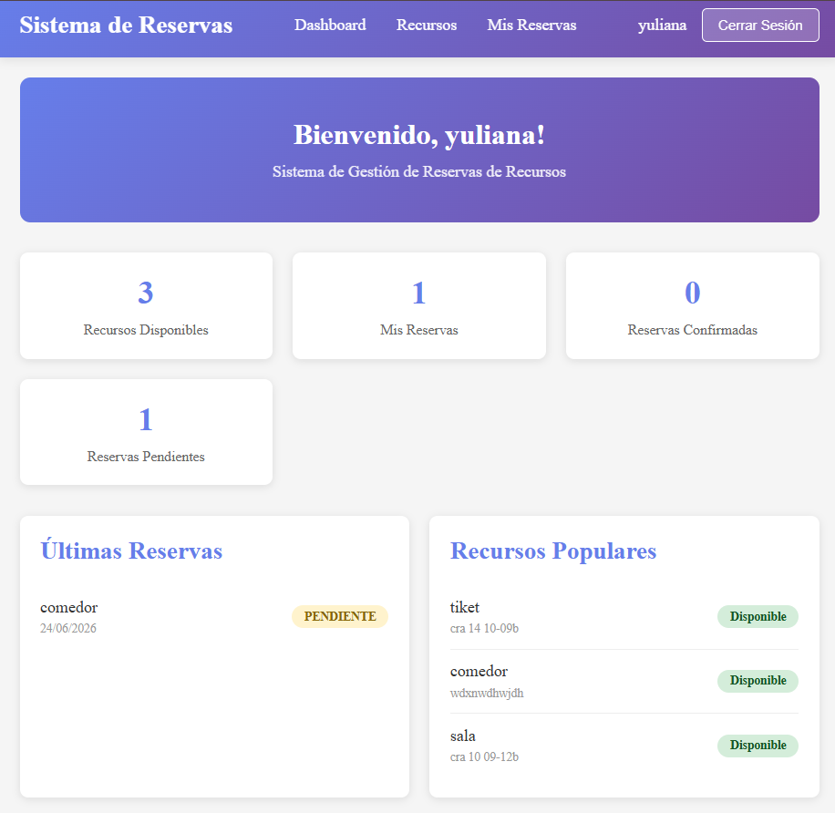
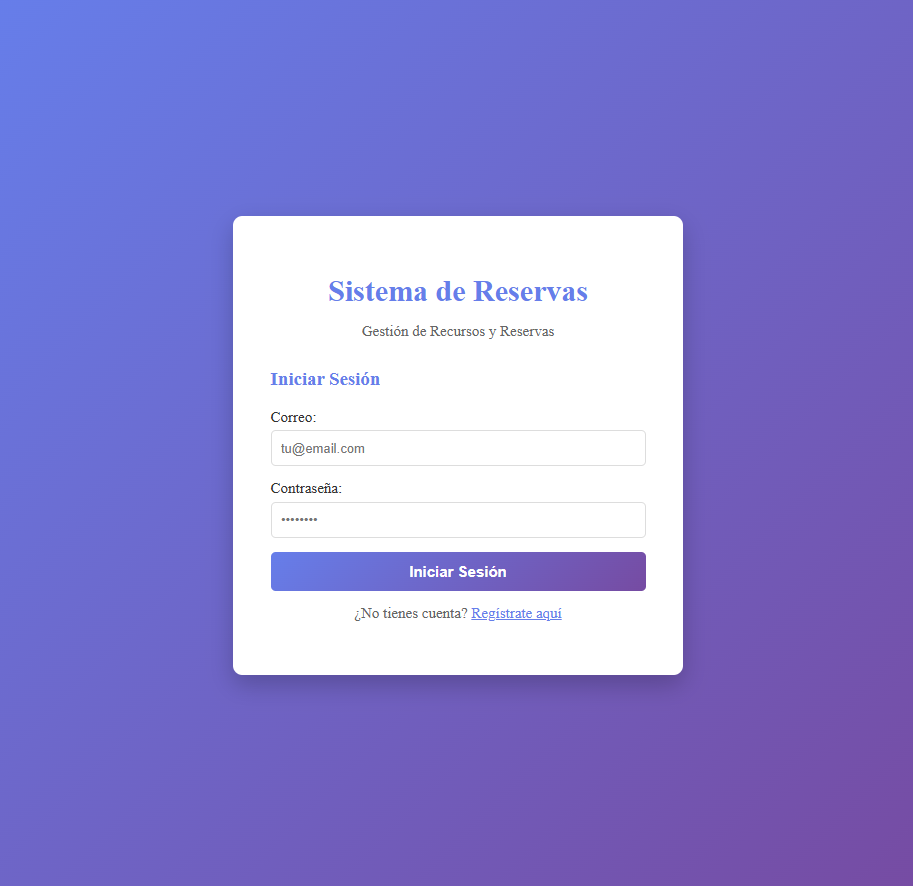

# 📅 Sistema de Reservas - Documentación Completa

## 📋 Tabla de Contenidos
- [Descripción del Proyecto](#descripción-del-proyecto)
- [Tecnologías Utilizadas](#tecnologías-utilizadas)
- [Características Principales](#características-principales)
- [Modelo de Base de Datos](#modelo-de-base-de-datos)
- [Instalación y Configuración](#instalación-y-configuración)
- [Despliegue](#despliegue)
- [Estructura del Proyecto](#estructura-del-proyecto)
- [Capturas de Pantalla](#capturas-de-pantalla)
- [Guía de Uso](#guía-de-uso)

---

## 📝 Descripción del Proyecto

**Sistema de Reservas** es una aplicación web moderna desarrollada con **Angular 21** y **Firebase** que permite gestionar reservas de recursos (salas, equipos, laboratorios, etc.) en instituciones educativas.

### Objetivos:
- ✅ Permitir que usuarios creen y gestionen sus reservas
- ✅ Administrar recursos disponibles (crear, editar, eliminar)
- ✅ Validar conflictos de horarios
- ✅ Mantener un historial de acciones
- ✅ Rol-based access control (Admin vs Usuario)
- ✅ Interfaz moderna y responsive

---

## 🛠️ Tecnologías Utilizadas

### Frontend
| Tecnología | Versión | Propósito |
|-----------|---------|----------|
| **Angular** | 21.0.0 | Framework principal |
| **TypeScript** | ~5.9.2 | Lenguaje de programación |
| **RxJS** | ~7.8.0 | Programación reactiva |
| **FormsModule** | 21.0.0 | Formularios reactivos |

### Backend & Base de Datos
| Tecnología | Propósito |
|-----------|----------|
| **Firebase Authentication** | Autenticación de usuarios |
| **Firestore Database** | Base de datos NoSQL |
| **Firebase Hosting** | Hosting de la aplicación |

### Herramientas de Desarrollo
| Herramienta | Propósito |
|-----------|----------|
| **Angular CLI** | 21.0.3 - Scaffolding y build |
| **Vite** | Build optimization |
| **Vitest** | Testing unitario |
| **Vercel** | Despliegue en producción |

---

## ⭐ Características Principales

### 👤 Autenticación y Autorización
- Registro de nuevos usuarios
- Login con email y contraseña
- Gestión de sesiones con Firebase Auth
- Roles: **Admin** y **Usuario**
- Guards de rutas protegidas

### 📂 Gestión de Recursos (Admin)
- Crear nuevos recursos
- Editar información de recursos
- Eliminar recursos
- Ver lista de todos los recursos
- Filtrar por tipo y estado

### 📋 Sistema de Reservas
- Crear reservas seleccionando recurso, fecha y hora
- Validación automática de conflictos horarios
- Ver mis reservas
- Cancelar reservas
- Estado de reservas: pendiente, confirmada, cancelada, completada

### 📊 Dashboard
- Vista general de estadísticas
- Mis reservas recientes
- Recursos populares
- Contador de confirmadas vs pendientes

### 📜 Historial y Auditoría
- Registro completo de acciones
- Cambios en reservas
- Trazabilidad de operaciones

---

## 🗄️ Modelo de Base de Datos

### Arquitectura Firestore

```
firestore/
├── usuarios/
│   └── {uid}
│       ├── id: string (Firebase UID)
│       ├── nombre: string
│       ├── email: string
│       ├── rol: 'admin' | 'usuario'
│       ├── estado: 'activo' | 'inactivo'
│       ├── fechaRegistro: timestamp
│       └── telefono?: string
│
├── recursos/
│   └── {recursoId}
│       ├── id: string
│       ├── nombre: string
│       ├── descripcion: string
│       ├── tipo?: 'sala' | 'equipo' | 'laboratorio' | 'otro'
│       ├── capacidad: number
│       ├── ubicacion: string
│       ├── estado?: 'disponible' | 'mantenimiento' | 'no-disponible'
│       ├── creadoPor?: string (User UID)
│       ├── fechaCreacion?: timestamp
│       └── horariosDisponibles?: CBAHorario[]
│
├── reservas/
│   └── {reservaId}
│       ├── id: string
│       ├── usuarioId: string (Firebase UID)
│       ├── recursoId: string
│       ├── fechaInicio: timestamp
│       ├── fechaFin: timestamp
│       ├── estado: 'pendiente' | 'confirmada' | 'cancelada' | 'completada'
│       ├── proposito?: string
│       ├── notas?: string
│       └── fechaCreacion?: timestamp
│
└── historial/
    └── {historialId}
        ├── id: string
        ├── usuarioId: string
        ├── recursoId: string
        ├── accion: 'creada' | 'modificada' | 'cancelada' | 'completada'
        ├── fechaAccion: timestamp
        └── detalles?: string
```

### Relaciones
- **Usuario → Reservas**: 1:N (Un usuario puede tener muchas reservas)
- **Recurso → Reservas**: 1:N (Un recurso puede tener muchas reservas)
- **Usuario → Historial**: 1:N (Rastreo de acciones por usuario)

### Reglas de Firestore Security
```javascript
rules_version = '2';
service cloud.firestore {
  match /databases/{database}/documents {
    // Usuarios: Solo el propietario puede leer, solo escritura de admin
    match /usuarios/{userId} {
      allow read: if request.auth.uid == userId;
      allow write: if request.auth.uid == userId;
    }
    
    // Recursos: Lectura pública, escritura solo admin
    match /recursos/{documento=**} {
      allow read: if request.auth != null;
      allow write: if request.auth.token.customClaims.admin == true;
    }
    
    // Reservas: Lectura del propietario, escritura autenticado
    match /reservas/{documento=**} {
      allow read: if request.auth != null;
      allow write: if request.auth.uid == resource.data.usuarioId;
    }
    
    // Historial: Lectura y escritura autenticado
    match /historial/{documento=**} {
      allow read, write: if request.auth != null;
    }
  }
}
```

---

## 📦 Instalación y Configuración

### Prerequisites
- Node.js 20+
- npm 10.9.2+
- Cuenta de Firebase

### Pasos de Instalación

```bash
# 1. Clonar el repositorio
git clone <repo-url>
cd "Sistema de Reservas"

# 2. Instalar dependencias
npm install

# 3. Configurar Firebase
# Editar src/app/services/firebase.service.ts con tus credenciales
# Obtener de: Firebase Console → Project Settings → Web App Config
```

### Variables de Entorno (Firebase)
Crear archivo `src/environments/environment.ts`:

```typescript
export const environment = {
  production: false,
  firebase: {
    apiKey: "YOUR_API_KEY",
    authDomain: "your-project.firebaseapp.com",
    projectId: "your-project-id",
    storageBucket: "your-project.appspot.com",
    messagingSenderId: "123456789",
    appId: "1:123456789:web:abcdef"
  }
};
```

### Desarrollo Local

```bash
# Iniciar servidor de desarrollo
npm start
# Navegar a http://localhost:4200/

# Ejecutar tests
npm test

# Build para producción
npm run build
```

---

## 🚀 Despliegue
Accede al sistema aquí:

👉 [Sistema de Reservas](https://sistema-de-reservas-omega.vercel.app/login)


### Vercel (Recomendado)

```bash
# 1. Instalar Vercel CLI
npm i -g vercel

# 2. Conectar proyecto
vercel link

# 3. Configurar environment variables en Vercel Dashboard

# 4. Deploy
vercel --prod
```

### Variables de Entorno en Vercel
```
VITE_FIREBASE_API_KEY=xxx
VITE_FIREBASE_AUTH_DOMAIN=xxx
VITE_FIREBASE_PROJECT_ID=xxx
VITE_FIREBASE_STORAGE_BUCKET=xxx
VITE_FIREBASE_MESSAGING_SENDER_ID=xxx
VITE_FIREBASE_APP_ID=xxx
```

### Firebase Hosting

```bash
# 1. Instalar Firebase CLI
npm install -g firebase-tools

# 2. Login
firebase login

# 3. Inicializar proyecto
firebase init

# 4. Deploy
firebase deploy
```

**URL de Producción**: Será proporcionada por Vercel o Firebase Hosting

---

## 📁 Estructura del Proyecto

```
Sistema-de-Reservas/
├── src/
│   ├── app/
│   │   ├── components/
│   │   │   ├── auth/
│   │   │   │   └── login.component.ts
│   │   │   ├── dashboard/
│   │   │   │   └── dashboard.component.ts
│   │   │   ├── navbar/
│   │   │   │   └── navbar.component.ts
│   │   │   ├── recursos/
│   │   │   │   └── recursos.component.ts
│   │   │   └── reservas/
│   │   │       └── reservas.component.ts
│   │   ├── services/
│   │   │   ├── auth.service.ts
│   │   │   ├── firebase.service.ts
│   │   │   ├── recursos.service.ts
│   │   │   ├── reservas.service.ts
│   │   │   └── usuarios.service.ts
│   │   ├── guards/
│   │   │   ├── auth.guard.ts
│   │   │   └── admin.guard.ts
│   │   ├── models/
│   │   │   └── cba-models.ts
│   │   ├── app.routes.ts
│   │   ├── app.config.ts
│   │   └── app.ts
│   ├── environments/
│   │   ├── environment.ts
│   │   └── environment.prod.ts
│   ├── main.ts
│   └── index.html
├── package.json
├── tsconfig.json
├── angular.json
├── vercel.json
└── README.md
```

---

## 📸 Capturas de Pantalla

### 1. Dashboard
Panel principal con estadísticas y reservas recientes


### 2. Gestión de Recursos (Admin)


**Características:**
- Crear nuevos recursos
- Editar información
- Eliminar recursos
- Listar todos los recursos

### 3. Sistema de Reservas


**Características:**
- Selector de recursos
- Fecha y hora de inicio/fin
- Validación de conflictos
- Lista de mis reservas

### 4. Autenticación


**Características:**
- Login con email/password
- Registro de nuevos usuarios
- Recuperación de contraseña (Firebase)

---

## 📖 Guía de Uso

### Para Usuarios
1. **Registrarse**: Crear cuenta con email y contraseña
2. **Ver Dashboard**: Acceder al panel principal con estadísticas
3. **Ver Recursos**: Navegar a "Recursos" para ver disponibilidad
4. **Crear Reserva**: 
   - Ir a "Mis Reservas"
   - Seleccionar recurso
   - Ingresar fecha y hora
   - Confirmar
5. **Cancelar Reserva**: En "Mis Reservas", hacer clic en cancelar

### Para Administradores
1. **Ingresar como Admin**: 
  -admin12345
  -admin@gmail.com
2. **Crear Recursos**:
   - Ir a "Recursos"
   - Hacer clic en "Nuevo Recurso"
   - Ingresar nombre, descripción, ubicación, capacidad
   - Guardar
3. **Editar Recursos**: Hacer clic en "Editar" en la tarjeta del recurso
4. **Eliminar Recursos**: Hacer clic en "Eliminar" (con confirmación)
5. **Ver Historial**: En Panel Admin → Historial (esto solo puede observar desde la base de datos)


---

## Autor
  Saira Yineth Aragon Suarez


---


